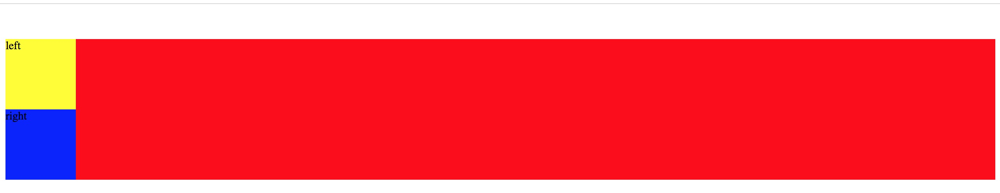

overflow:hidden可以解决溢出,坍塌,清除浮动

清除浮动的缺点：假如父高度小于子高度，会被截掉
```
<div id="a">
    <div id="a1">left</div>
    <div id="a2">right</div>
</div>
```
a1设置margin-top:50px;
a1的上端距离浏览器的顶部有50px而不是对它的父div，更可怕的是它甚至向下顶了它的父div，`这就是坍塌`。
这里多说一句：这种坍塌只针对于父亲的第一个儿子，a2设置margin-top：50px则不会有任何不妥。 


```
#a1{
    background: yellow;
    margin-top:50px;
}
#a2{
    background: blue;
}
#a1,#a2{ 
    width: 100px;
    height: 100px;
    /*float: left;*/
}
#a{
    background: red;
    /*清楚浮动，此种方法假如父高度小于子高度，会被截掉*/
    /*overflow: hidden;*/ 
    zoom:1;
}
```
没见overflow: hidden; 出现


```
#a1{
    background: yellow;
    margin-top:50px;
}
#a2{
    background: blue;
}
#a1,#a2{
    
    width: 100px;
    height: 100px;
    /*float: left;*/
}
#a{
    background: red;
    /*清楚浮动，此种方法假如父高度小于子高度，会被截掉*/
    overflow: hidden; 
    zoom:1;
}
```
加上 overflow: hidden;  解决塌陷


```
#a1{
    background: yellow;
    margin-top:50px;
}
#a2{
    background: blue;
}
#a1,#a2{   
    width: 100px;
    height: 100px;
    float: left;
}
#a{
    background: red;
    /*清楚浮动，此种方法假如父高度小于子高度，会被截掉*/
    /*overflow: hidden; */
    zoom:1;
    /*height: 150px;*/
}
```

在a1上加上float: left;不会出现塌陷问题
浮动的div根本不用考虑坍塌问题。
