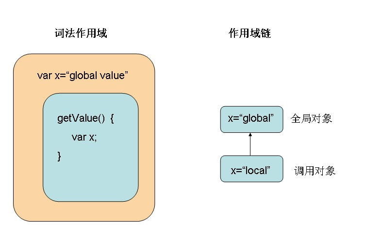

```
 var x = "globol value";
 var getValue = function(){
    alert(x); //弹出"undefined"
    var x = "local value";
    alert(x); //弹出"local value";
 }
 getValue();
```
第一个var x中的x是全局变量，说到这里顺带说下，js解释器在执行任何代码之前会`先创建一个全局对象（global object）`，全局变量就是相当于这个全局对象的一个`属性`。同理，对于getValue这个函数，就会生成一个叫做`调用对象的东西`，局部变量就是这个调用对象的属性，例子中第二个var x中的x就是局部变量。

```
function test(o){
    var i = 0;
    if(typeof o == "object"){
        var j = 0;                    
        for(var k=0; k < 10; k++){
            console.log(k);//0-9
        }
        console.log(k);    //10  k是可以被访问到的,即使他在for子句内
    }
    console.log(j);        //0  说明j是可以被访问到的,即使他在if子句内
}
test({a:1})
```

当定义了一个函数后，当前的作用域就会被保存下来，并且成为函数内部状态的一部分。

当getValue函数被定义的时候，他的作用域被保存起来，还有被加到作用域链上，他的上端就是全局执行环境。
当调用getValue方法的时候，js解释器`首先会把作用域设置为定义函数的时候的那个作用域`（即之前保存那个），接下来，他在`作用域的前加上调用对象即getValue这个函数`，`再在他的上端加上全局对象`。

## 延伸到闭包
清楚了以上关于词法作用域的概念后，我们就不难理解闭包的概念了，他只是用到了作用域链的`不可向下性（我取的名词..）`，`即下面的作用域可以访问上面的，但上面的不可以访问下面的`。当然这只是构成闭包的一个条件，闭包更重要的还是外部函数持有内部函数的一个嵌套函数的引用，简单看下例子：
```
function foo(){
    var age = 10;
    function boo(){
            age += 10;
            return age;
    }
    return boo;
}

var tx = new foo();
alert(tx());    //20
```

参考博客：https://www.cnblogs.com/xiaohuochai/p/5700095.html