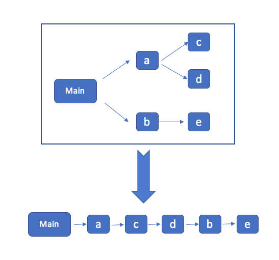
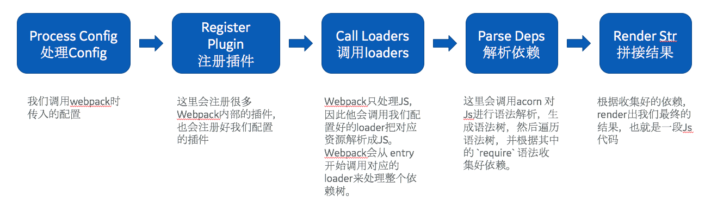
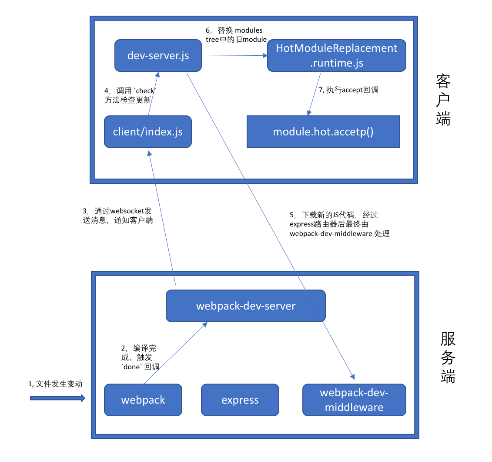
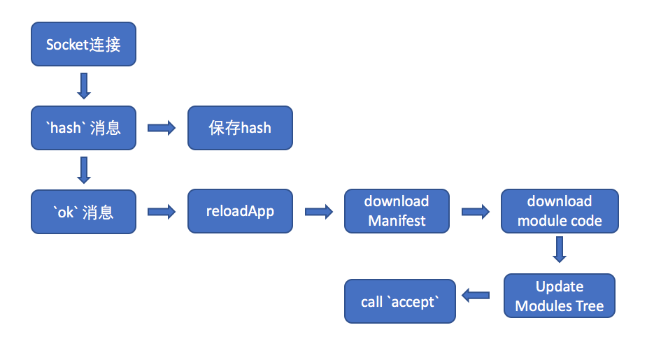

https://www.jianshu.com/p/652fbae768bf (解释更新原理)
1. Webpack编译期，为需要热更新的 entry 注入热更新代码(EventSource通信)
2. 页面`首次打开后，服务端与客户端通过 EventSource 建立通信渠道，把下一次的 hash 返回前端` (hash值是给下一次的)
3. 客户端获取到hash，`这个hash将作为下一次请求服务端 hot-update.js 和 hot-update.json的hash`
4. 修改页面代码后，`Webpack 监听到文件修改后`，`开始编译，编译完成后，发送 build 消息给客户端`
5. 客户端获取到hash，成功后客户端构造hot-update.js script链接，然后插入主文档
6. hot-update.js 插入成功后，`执行hotAPI 的 createRecord 和 reload方法`，获取到 Vue 组件的 render方法，`重新 render 组件`， 继而`实现 UI 无刷新更新`。

每次服务端发送的消息(EventStrean) 的 hash 将作为下次 hot-update.json 和 hot-update.js 文件的 hash。
这句话的意思是EventStrean 服务器向客户端推送hash值，这个hash值作为下次hot-update.json 和 hot-update.js 文件的 hash。

https://www.jianshu.com/p/652fbae768bf

EventSource 接口`用于接收服务器发送的事件`。它`通过HTTP连接到一个服务器`，以text/event-stream 格式接收事件, 不关闭连接。通过 EventSource 服务端可以主动给客户端发现消息，使用的是 HTTP协议，单项通信，只能服务器向浏览器发送； 与 WebSocket 相比轻量，使用简单，支持断线重连。更多信息参考MDN

生成的js和json有什么用？
第一次，通过EventSource服务器返回hash值，这个hash值作为下一次请求服务端 hot-update.js 和 hot-update.json的hash。（第一次还没有js和json）
当文件第一次发生改变时，生成hot-update.js 和 hot-update.json（此时的文件中的hash值是第一次服务器返回的），并服务器接着向客户端发送hash值。
当文件再次变化时，hot-update.js 和 hot-update.json带有hash的url会去请求服务器，上一次请求来的hash值会替换js 和 json带有的hash。
当文件没有变化，json和js文件的带有hash的url还会去请求服务器？
怎么判断文件更新？
文件没有改变，但是再次保存了，会执行Compiled。
当文件改变时，编译完成，然后想服务器发送数据（包含hash）。

依次执行 build 和 sync 逻辑后，再进行热更新。
前端通过 ajax 获取热更新文件内容，

hotCurrentHash：每次服务端发送的消息(EventStrean) 的 hash
var __webpack_require__.p + "" + hotCurrentHash + ".hot-update.json";
var request = new XMLHttpRequest();
request.open("GET", requestPath, true);
请求完热更新内容之后，向文档插入带有hotCurrentHash的 hot-update.js script ，并生产新的热更新hash值。

hot-update文件就是进行热替换需要的文件


hot-update.js是改变后的js文件  http://localhost:3000/0.49bd04c9ec26c75bd247.hot-update.js
hot-update.json是  http://localhost:3000/49bd04c9ec26c75bd247.hot-update.json
{"h":"40fa4c62c21f1a3d4753","c":[0]}

hot-update.js会依次插入到html中
生成的js代码中有installedModules，证明代表有缓存机制。
当更改获取到新的js文件，并替换旧的js文件，第一次启动因为没有更改js文件，只生产hash值传给客户端，当文件改变时，应用生产的hash名来生产js和json文件。当再次改变时，服务器把生成的文件给前端。
服务器生成的新hash值和客户端的hash值比较，如果相同调用缓存，不相同再此请求服务器的新js文件。


什么时候执行compile和webpack 的 done 事件？

当所有的js代码都在一个文件中时，是怎么替换掉被修改的那一部分？
webpack 会通过 actorn 解析JS语法，并对 require('xxx.js') 做依赖收集。webpack最终打包出来的 bundle.js 中会把所有的`模块变成一个数组，也就是把一颗树变成了一个数组`。
深度优先遍历的递归解法，而且是先序优先遍历。



## 主线剧情
1. webpack 的编译过程主要有哪些阶段？（生命周期）
2. webpack 是如何 从 entry 开始解析出整个依赖树的？
3. loaders 是在何时被调用的？
4. 最终是如何知道要生成几个文件，以及每个文件的内容的？ 而其他一些不重要的问题我们尽量忽略，比如如何解析配置，如何处理错误，HASH 规则等。等看完主线流程后再回头单独看这些点。



webpack `整体上是一个插件的架构`，`绝大多数功能都是通过插件实现的`。 这里有一点比较容易让人迷惑，webpack 的插件有一个apply方法，他是在webpack的生命周期上再注册一些回调函数。所以插件有两个阶段：
- 注册阶段，每个插件会在自己需要的生命周期上`注册自己的回调`
- 编译阶段，webpack会把编译过程`分为很多个生命周期`，在编译启动后，会通过 applyPlugins(name) 各个生命周期中调用对应的回调函数。

总结webpack 流程
到此为止，我们从代码上大概理清楚了webpack 是如何编译我们的源码的。总结下来主要是如下几步：

1. 根据我们的webpack配置注册好对应的插件
2. 调用 compile.run 进入编译阶段，
3. 在编译的第一阶段是 compilation，他会注册好不同类型的module对应的 factory，不然后面碰到了就不知道如何处理了
4. 进入 make 阶段，会从 entry 开始进行两步操作：
5. 第一步是调用 loaders 对模块的原始代码进行编译，转换成标准的JS代码
6. 第二步是`调用 acorn 对JS代码进行语法分析`，然后收集其中的依赖关系。每个模块都会记录自己的依赖关系，从而形成一颗关系树
7. 最后调用 compilation.seal 进入 render 阶段，根据之前收集的依赖，决定生成多少文件，每个文件的内容是什么
这只是非常非常粗略的流程，实际上在整个过程中 webpack 的生命周期包含几十个点，感觉很难完全搞清楚每一步都是干什么的（其实也没有必要）

## HMR的原理
https://github.com/lihongxun945/diving-into-webpack/blob/master/7-hmr.md

 ### 热更新阶段： 
1. webpack `监听文件变化`，并完成编译 
2. webpack-dev-server 监听 done 事件，并`通过 websocket 向客户端发送消息` 
3. 客户端经过处理后，`请求新的JS模块代码 `
4. WebpackDevServer 从 MemoryFileSystem 中取出代码，并返回（创建 一个 MemoryFileSystem 实例，替换掉 webpack.outputFileSystem，这样webpack 编译出的文件其实都是存在内存中，而不是磁盘上；强求编译后的文件是从内存中读取，也就是把对编译后的文件的请求，都重定向到上面创建的 MemoryFileSystem 中。）


**我一直的盲点，现在理清楚了**
在热更新阶段，首先会触发这几行代码：
```
  compiler.plugin('done', (stats) => {
    this._sendStats(this.sockets, stats.toJson(clientStats));
    this._stats = stats;
  });
  
```
当完成编译的时候，就通过 websocket 发送给客户端一个消息（一个 `hash` 和 一个`ok`)。
`_sendStats 会通过 websocket 给客户端发送两条消息`。 `客户端收到消息后，会去请求一个 json 配置文件`，`然后根据配置请求新的JS模块代码`。 (先根据hash值请求json配置文件，然后根据json配置文件去请求新的js模块代码。)
当请求调用getFilenameFromUrl（从url中获取filename），如果`发现这个请求是 publicPath 中的文件内容`，那么就从 fs 中`取出内容并返回`(此内容就是从编译后保存在内存中的js文件)。 如果不是，那么 next，交给 `webpack-dev-server` 进行处理（也就是拦截）。

服务器监听文件变化，新的js文件是前端根据json配置向后端请求获取。




 ### HMR 在浏览器中的工作流程
 webpack 在 启用HMR之后，会在server端（nodejs端）监听文件改动，并且一旦发生变动就把新的代码编译后发送到浏览器。`浏览器中也会有HMR相关的代码，会通过socket和server保持通信，获取新代码并进行热替换`。

 **保持通讯方式还有待研究，现在查找的资料有socket和EventSource通信**

 

 style-loader 不处理热更新事件并不是投机取巧，而是必须不能处理。
 style-loader 的做法：未启用 css modules， 则可以直接更新 style内容即可。如果启用了，因为还需要父组件更新，所以这里就不作处理，直接冒泡到父组件处理（style-loader被父组件重新调用了一次）
## 我的理解：
服务器进行热更新，前端是进行请求热更新内容。
热更新后触发UI更新

## 面试
webpack是一个前端打包工具，它的理念就是`一切皆模块`，能把css、js文件合并成一个文件，完美解决了前端模块依赖的问题。优化了前端开发流程。
它的原理是：
当js或者css文件变化时，比较hash值是否发生变化来更新文件。
当文件改变时，编译，服务器生成的新hash值和客户端的hash值比较，如果相同调用缓存，不相同再此请求服务器的新js文件。当发生文件变化，前端去请求更新后的文件。

webpack 流程：
1. 根据我们的webpack配置注册好对应的插件
2. 把loader中的文件都转化成js文件
3. 分析每个模块js文件的依赖关系，形成关系树（webpack 会通过 actorn 解析JS语法，并对 require('xxx.js') 做依赖收集。webpack最终打包出来的 bundle.js 中会把所有的`模块变成一个数组，也就是把一颗树变成了一个数组`。深度优先遍历的递归解法，而且是`先序优先遍历`。）
4. 根据关系树，确定生成多少个js文件，并且生成对应内容

热更新：
1. webpack `监听文件变化`，并完成编译 
2. webpack-dev-server 监听 done 事件，并`通过 websocket 向客户端发送消息` （一个 `hash` 和 一个`ok`消息）
3. 客户端收到消息后，`请求新的JS模块代码 `  （服务器监听文件变化，新的js文件是前端根据json配置向后端请求获取。）
4. 服务器从内存中返回数据

常用插件：
htmlWebpackPlugin
extract-text-webpack-plugin
mini-css-extract-plugin
style-loader
css-loader
sass-loader
html=loader
CopyWebpackPlugin


## 有没有去研究webpack的一些原理和机制，怎么实现的(面试)
1. 解析webpack配置参数，合并从shell传入和webpack.config.js文件里配置的参数，生产最后的配置结果。

2. 注册所有配置的插件，好让插件监听webpack构建生命周期的事件节点，以做出对应的反应。

3. 从配置的entry入口文件开始解析文件构建AST语法树，找出每个文件所依赖的文件，递归下去。

4. 在解析文件递归的过程中根据文件类型和loader配置找出合适的loader用来对文件进行转换。

5. 递归完后得到每个文件的最终结果，根据entry配置生成代码块chunk。

6. 输出所有chunk到文件系统。